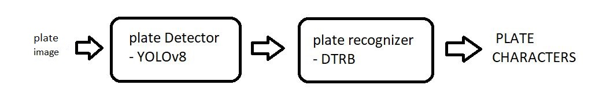
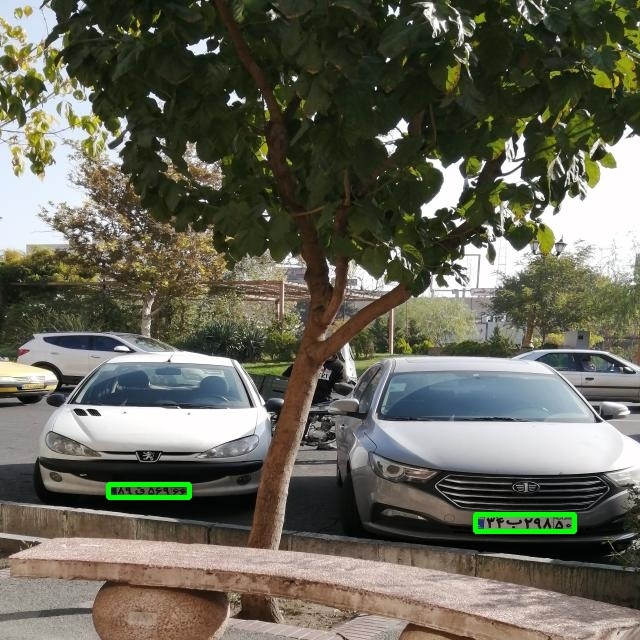
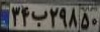

# License Plate Detection + Recognition + Verification : 
using pipeline method and Object Oriented DTRB


# Description :
Here, in second part ,  we want to **connect** plate_detector & plate_recognizer to each other, same as the below image . <br/>
it means that the output of the DETECTOR should be use as input of the RECOGNIZER . 

<p float="center">
     
</p>

here , we want license plates which have over %80 confidence . <br/>
we are going to use [deep-text-recognition-benchmark](https://github.com/clovaai/deep-text-recognition-benchmark/tree/master) repository to recognize persian license plate numbers .


<br/>

# How to install :
```
pip install -r requirements.txt
```
# How to run :
+ run this command for detection and recognition task for just one image at a time : <br/>
```
python main.py --Transformation TPS --FeatureExtraction ResNet --SequenceModeling BiLSTM --Prediction Attn 
```
----------------------------------------------------------------

+ run this command for detect and recognize all test images , and store them into database :
```
python detection_recognition_preparedata_for_DB.py --Transformation TPS --FeatureExtraction ResNet --SequenceModeling BiLSTM --Prediction Attn
```
----------------------------------------------------------------

+ ###  Run this command to verify your input license plate :
```
python verification.py --Transformation TPS --FeatureExtraction ResNet --SequenceModeling BiLSTM --Prediction Attn --input_images io/input/14.jpg
```

--------------------------------------------
<br/>

###  Download pre-trained weights : <br/>

+ YOLO detector : <br/>

https://drive.google.com/file/d/1ki7GNd_3zJ8bUIEBBc8tkyiVvMEJZsvs/view?usp=drive_link

+ DTRB recognizer : <br/>

https://drive.google.com/file/d/1CI6C9ButxSbk8FdWLCwl-70z63sRLci6/view?usp=drive_link

then put these files into their related folder , in weights folder .

Also , you can change value of threshold using : --threshold < argument value >


# Results :
<br/>

### Detected plates :
 

|    Ground Truth  | predicted_labels | confidence score |
|:-------------------------------------:| :-------------------------------------:| :-------------------------------------:|
|  | 89q56966 | 0.9922
|  | 34b29850 | 0.9906

