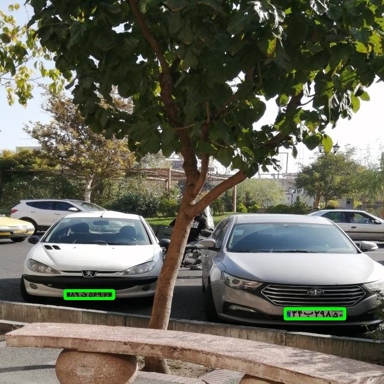
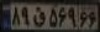
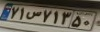

# OCR with pipeline and Object Oriented DTRB:


# Description :
Here, in second part ,  we want to **connect** plate_detector & plate_recognizer to each other, same as the below image . <br/>
it means that the output of the DETECTOR should be use as input of the RECOGNIZER . 

<p float="center">
     
</p>

here , we want license plates which have over %80 confidence . <br/>
we are going to use [deep-text-recognition-benchmark](https://github.com/clovaai/deep-text-recognition-benchmark/tree/master) repository to recognize persian license plate numbers .


<br/>

# How to install :
```
pip install -r requirements.txt
```
# How to run :
```
python main.py --Transformation TPS --FeatureExtraction ResNet --SequenceModeling BiLSTM --Prediction Attn 
```


# Results :

+ trained weights : <br/>

YOLO detector : <br/>

https://drive.google.com/file/d/1ki7GNd_3zJ8bUIEBBc8tkyiVvMEJZsvs/view?usp=drive_link

DTRB recognizer : <br/>

https://drive.google.com/file/d/1CI6C9ButxSbk8FdWLCwl-70z63sRLci6/view?usp=drive_link


<br/>

### Detected plates :
 

|    Ground Truth  | predicted_labels | confidence score |
|:-------------------------------------:| :-------------------------------------:| :-------------------------------------:|
|  | 89q56966 | 0.9922
|  | 34b29850 | 0.9906
