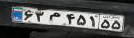
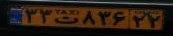
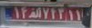
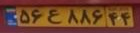
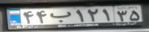
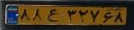
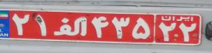

# OCR with pipeline and Object Oriented DTRB:


# Description :


# How to install :
```
pip install -r requirements.txt
```
# How to run :
```
python main.py --Transformation TPS --FeatureExtraction ResNet --SequenceModeling BiLSTM --Prediction Attn 
```
or 
```
python deep_text_recognition_benchmark/DTRB_OO.py 
--Transformation TPS --FeatureExtraction ResNet 
--SequenceModeling BiLSTM --Prediction Attn 
--image_folder io/input_plates 
--saved_model weights/DTRB-Recognizer/DTRB_best_accuracy_TPS_ResNet_BiLSTM_Attn.pth 
```

# Results :

+ trained weights :
YOLO detector : <br/>
```
https://drive.google.com/file/d/1ki7GNd_3zJ8bUIEBBc8tkyiVvMEJZsvs/view?usp=drive_link

```
DTRB recognizer : <br/>
```
https://drive.google.com/file/d/1CI6C9ButxSbk8FdWLCwl-70z63sRLci6/view?usp=drive_link
```


<br/>

|                Ground Truth                 | predicted_labels |
|:-------------------------------------:| :-------------------------------------:| 
|  | 63m45154 |
|  | 33t83622 |
|  | 11a1211 |
|  | 56e88644 |
|  | 44b12135 |
|  | 88e32768 | 
|  | 21a43513 | 